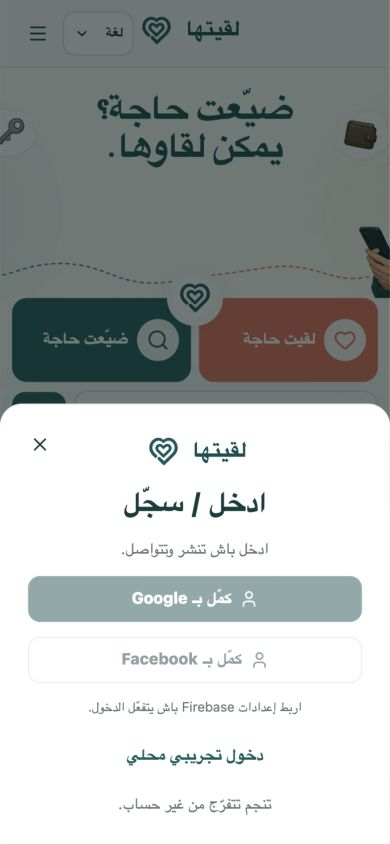

# L9itha — لقيتها

L9itha is a Tunisian-first lost-and-found app: publish a missing or found item, discover likely matches, and verify ownership privately.


## What works

- Public multilingual discovery in Tunisian Arabic, Arabic, French, and English
- Structured lost/found reports with explainable match suggestions
- Google and Facebook sign-in through Firebase Authentication
- Private, membership-checked conversations and ownership claims
- Approximate public areas; street numbers and sensitive document photos are rejected
- SQLite persistence, moderation reports, saved items, notifications, and offline shell
- Responsive RTL/LTR interface for mobile and desktop

Instagram is not a native Firebase Authentication provider. The safe follow-up is a server-side Meta OAuth exchange that mints a [Firebase custom token](https://firebase.google.com/docs/auth/admin); no Instagram client secret belongs in the browser.

## Run locally

Requirements: Node.js 22.5+ and npm.

```bash
npm install
cp .env.example .env
npm run dev
```

Open `http://127.0.0.1:5173`. The API runs on `http://127.0.0.1:8787`; Vite proxies `/api` and `/uploads`.

Without Firebase variables, public browsing still works and development builds show a local demo sign-in. Production disables the demo endpoint.

## Firebase sign-in

1. Create a Firebase web app and enable [Google](https://firebase.google.com/docs/auth/web/google-signin) and [Facebook](https://firebase.google.com/docs/auth/web/facebook-login) in Authentication → Sign-in method.
2. Add the web values to the four `VITE_FIREBASE_*` entries in `.env`.
3. Set `FIREBASE_PROJECT_ID` on the server.
4. Provide Firebase Admin through Application Default Credentials. Keep service-account files outside the repository.
5. Add the deployed domain to Firebase Authorized domains and to each provider's OAuth settings.

The browser sends a Firebase ID token once; the API verifies it and returns an opaque `HttpOnly`, `SameSite=Lax`, production-`Secure` session cookie.

## Verify

```bash
npm run lint
npm test
npm run build
npm audit --omit=dev
```

The integration suite uses an isolated temporary database and covers authentication, cross-user conversation access, privacy enforcement, matching, rate limiting, reports, claims, comments, settings, and production cookie/header behavior.

## Production

Build and run directly:

```bash
npm ci
npm run build
L9ITHA_ALLOWED_ORIGIN=https://your-domain.example npm start
```

Or build the container. Firebase's public web values are build arguments because Vite embeds them in the client bundle:

```bash
docker build \
  --build-arg VITE_FIREBASE_API_KEY=... \
  --build-arg VITE_FIREBASE_AUTH_DOMAIN=... \
  --build-arg VITE_FIREBASE_PROJECT_ID=... \
  --build-arg VITE_FIREBASE_APP_ID=... \
  -t l9itha .

docker run --rm -p 4173:4173 \
  -e FIREBASE_PROJECT_ID=... \
  -e L9ITHA_ALLOWED_ORIGIN=https://your-domain.example \
  -v l9itha-data:/app/.data \
  l9itha
```

Before going live, use HTTPS, persistent encrypted storage, backups, one exact allowed origin, and a Firebase Admin identity. See [SECURITY.md](SECURITY.md).

## Stack

React 19 · TypeScript · Vite · Node HTTP · `node:sqlite` · Firebase Auth · Sharp

## More screens

| Mobile home | Sign in |
|---|---|
|  |  |

The release QA notes and visual evidence are in [design-qa.md](design-qa.md).
